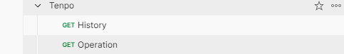
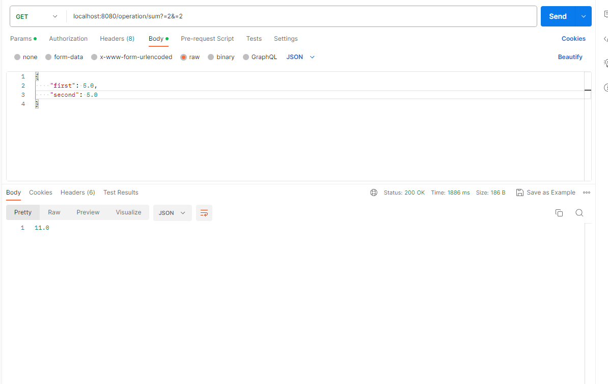
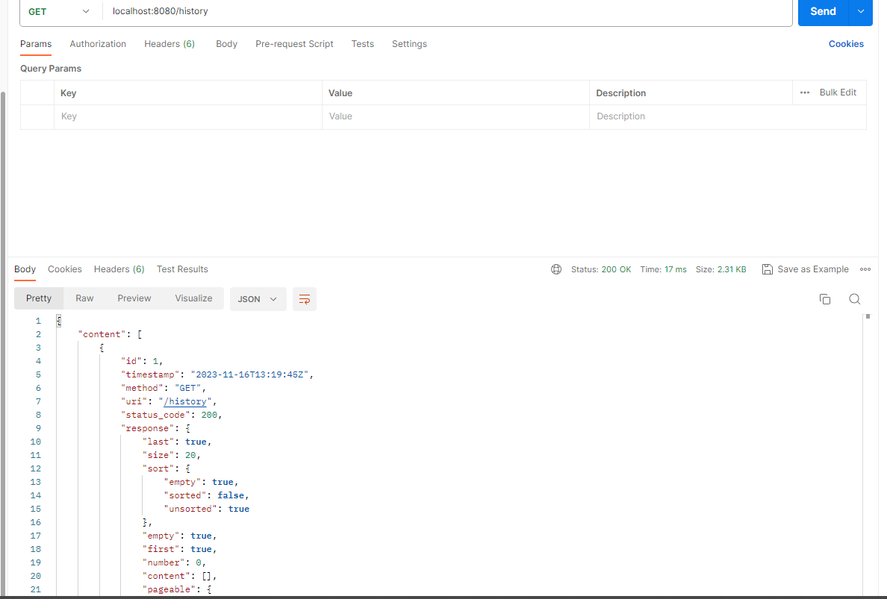
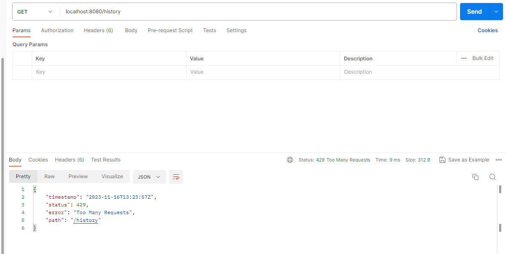

# challenge-tenpo - JFV

Debes desarrollar una API REST en Spring Boot utilizando java 11 o superior, con las siguientes funcionalidades:

Debe contener un servicio llamado por api-rest que reciba 2 números, los sume, y le aplique una suba de un porcentaje que debe ser adquirido de un servicio externo (por ejemplo, si el servicio recibe 5 y 5 como valores, y el porcentaje devuelto por el servicio externo es 10, entonces (5 + 5) + 10% = 11). Se deben tener en cuenta las siguientes consideraciones:

El servicio externo puede ser un mock, tiene que devolver el % sumado.

Dado que ese % varía poco, podemos considerar que el valor que devuelve ese servicio no va cambiar por 30 minutos.

Si el servicio externo falla, se debe devolver el último valor retornado. Si no hay valor, debe retornar un error la api.

Si el servicio falla, se puede reintentar hasta 3 veces.

Historial de todos los llamados a todos los endpoint junto con la respuesta en caso de haber sido exitoso. Responder en Json, con data paginada. El guardado del historial de llamadas no debe sumar tiempo al servicio invocado, y en caso de falla, no debe impactar el llamado al servicio principal.

La api soporta recibir como máximo 3 rpm (request / minuto), en caso de superar ese umbral, debe retornar un error con el código http y mensaje adecuado.

El historial se debe almacenar en una database PostgreSQL.

Incluir errores http. Mensajes y descripciones para la serie 4XX.


## Pre-requisites
* Apache Maven
* Docker

### Frameworks & Technologies
* Java 17
* Spring Boot 3.0.2
* PostgreSQL
* H2 Memory Database para ejecución de Test
* Controller advice
* Junit

### Clone 
```
https://github.com/pilon33/challenge-tenpo-jfv.git
```

### Build
```
mvn clean istall
```

### Collection Postman

_Import postman collection from:_

...**src/main/resources/Tenpo Collection.postman_collection.json**

### Execute
```
docker-compose up --build
```
### Images challenge example runnig  







